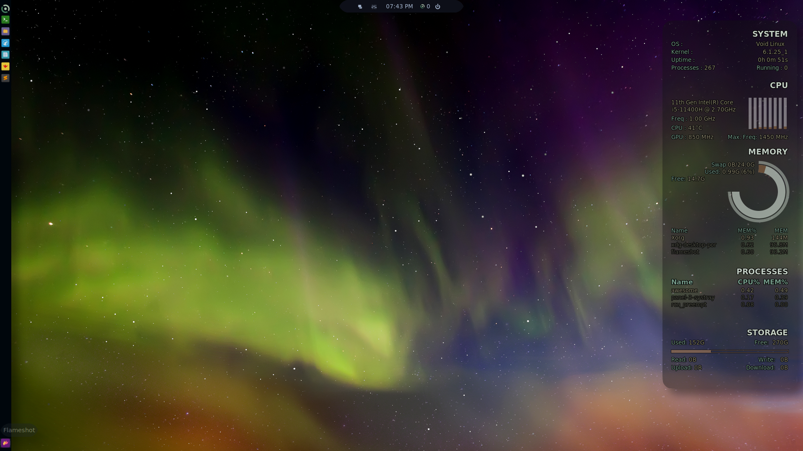
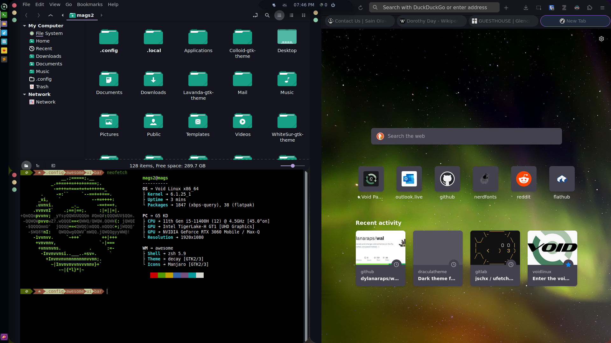
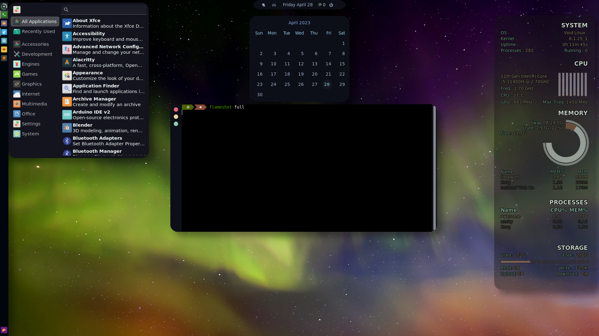

# dots2.0
A collection of new dotfiles for my VoidLinux install.

I make no guarantees that this is complete. Please see whiskermenu-nofavorites, conky-round, and Nemo-IconsSidebar for the other app-level edits made (ie. you need to download those directly and install). 

Credit for the main part of the awesome theme to @AlphaTechnolog https://github.com/AlphaTechnolog/dotfiles/tree/awesomewm-vertical

Awesome wibox widgets modified from the general awesomewm-widgets (the void widget replaces the ubuntu widget). 
